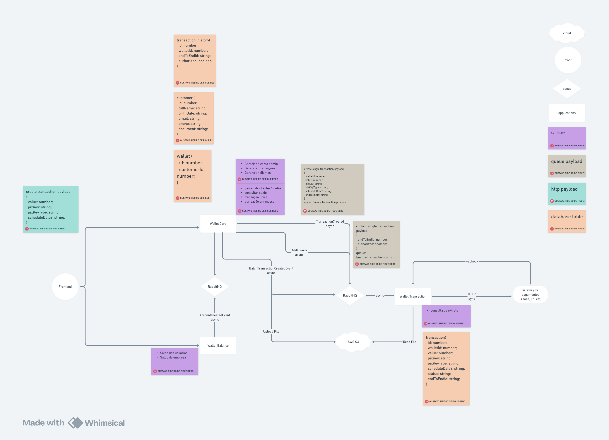

# UFLA - Universidade Federal de Lavras
## GCC267 - Projeto Integrador
### Semestre letivo: 2025/01

Alunos: 
- Gustavo Ribeiro de Figueiredo
- Cesar Augusto Pires
- Caio Cesar da Rocha

Professor:
- Rafael Serapilha Durelli

### Proposta do projeto:  
Vamos implementar um sistema de pagamentos, responsável, principalmente, por realizar transações pix.  
Nosso sistema irá se integrar com um Gateway de Pagamentos (Asaas, Efí, etc) e criar uma "Conta Bolsão", que basicamente é uma conta do nosso sistema no gateway. Quando novos clientes se cadastrarem em nosso sistema, suas contas só existirão dentro do nosso contexto, e todas as transações efetuadas serão transacionadas a partir da conta bolsão.  
A ideia é economizar custos com a infraestrutura do Gateway, já que os clientes do nosso sistema são transparentes para eles.  
A seguir, o diagrama básico da arquitetura:

  

## Serviços envolvidos
### [Wallet-core](https://github.com/projeto-integrado-2025-01/wallet-core-backend)  
Serviço responsável pelo Core do sistema.  
Responsabilidades:  
- Gerenciamento da Conta Bolsão junto ao Gaeway
- Gerenciamento de transações
- Gerenciamento de usuários e contas
- Realização de transação única
- Realização de transação em lote

### [Wallet-balance](https://github.com/projeto-integrado-2025-01/wallet-balance-backend)
Serviço responsável por saldos  
Responsabilidades:
- Gerenciamento de saldo
- Consulta de saldo
    - saldo dos usuários
    - saldo da Conta Bolsão

### [Wallet-transaction](https://github.com/projeto-integrado-2025-01/wallet-transaction)
Serviço responsável por processar transações  
Responsabilidades:
- Gerenciamento de transações únicas
- Gerenciamento de transações em lote

### [Front-end](https://github.com/projeto-integrado-2025-01/frontend)
Serviço responsável por consumir e apresentar as funcionalidades aos usuários  

## Funcionamento Geral
### Transações Simples
- Usuário informa ao sistema o valor da transação e a chave pix de destino. 
- Requisição é recebida no serviço Wallet-core e a informações são tratadas e validadas.
- Caso o usuário possa prosseguir com a transação, enviamos os dados para o RabbitMQ
- Serviço Wallet-transaction irá processar essa transação, comunicando diretamente com o Gateway.  
- Confirmação da transação é recebida em um webhook do serviço Wallet-transaction, que envia a confirmação novamente para o RabbitMQ
- Serviço Wallet-core confirma a transação e envia as informações da transação para o RabbitMQ
- Serviço Wallet-balance irá atualizar os saldos das contas envolvidas na transação

### Transações em lote
A dinâmica de funcionamento é basicamente a mesma. A diferença é que aqui os usuários informam uma planilha com as informações de valor e pix de destino.  
Salvamos essa planilha no AWS S3 e processamos posteriormente no serviço Wallet-transaction  

A proposta é fazer o processamento assíncrono em todas as etapas de uma transação.

## Stack
- React
- Node.js, Nestjs, Typescript
- MySQL
- RabbitMQ
- Docker
- Kubernetes
- AWS (S3, EKS)
- Keycloak
- Kong API Gateway